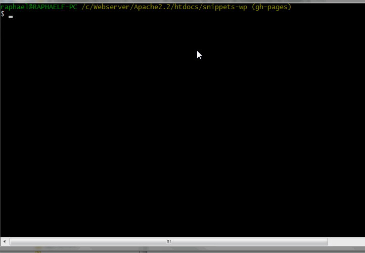
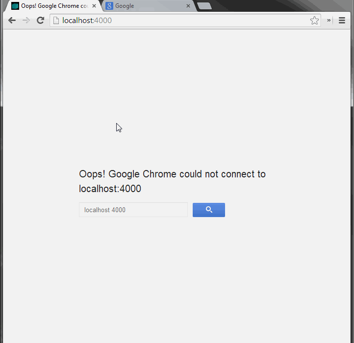

Snippets WP
===========

Uma coletânea de snippets para sites em WordPress!

## O que é?

Sabe quando você está desenvolvendo aquele site em WP e você precisa fazer algo que você já fez antes mas não lembra como faz? Ou se você acabou de criar uma funcionalidade bacana e quer guardar o _snippet_ para um projeto futuro? Aí que nasceu a idéia de ter um repositório que pudesse agrupar todos esses snippets. A princípio foi um projeto pessoal, mas se foi útil pra mim, pode ser para mais pessoas.

[Ver projeto](http://raphaelfabeni.github.io/snippets-wp/)

## Como funciona

O projeto foi feito em [Jekyll](http://jekyllrb.com/).

* Clone o projeto `https://github.com/raphaelfabeni/snippets-wp.git`
* Vá para a pasta que onde você clonou.
* [Inicie o jekyll](#iniciando-o-jekyll) `jekyll serve --watch --baseurl ''`
* Accesse: `http://localhost:4000`
* [Contribua com seu post](#criando-um-post) dentro da pasta *_posts*

## Iniciando o Jekyll



## Criando posts

* O nome do arquivo do post deve seguir a seguinte estrutura: `aaaa-mm-dd-titulo-post.md`
* No _template_ do post existem cinco parâmetros (YAML):
  * layout : Relacionado ao template geral dos posts (Você não vai mexer aqui)
  * title: O título do seu post.
  * date: A data de publicação do seu post (aaaa-mm-dd hh-mm)
  * description: Uma breve descrição do snippet.
  * file: Local onde o snippet deve ser inserido. A maioria provavelmente será no arquivo `functions.php`
* Na hora de digitar o seu snippet mágico, você deve colocá-lo dentro da tag: ``

Ficou confuso? Calma. Aqui um exemplo de como deve ser um post:

```php
---
layout: post
title:  "Título legal do post"
date:   2014-04-22 17:00
description: "Aqui vai uma descrição simples da funcionalidade do snippet."
file: 'functions.php'
---

Se precisar escrever ou detalhar algo a mais sobre o post/snippet insira aqui.


// Código do snippet

```

## Criando um post

